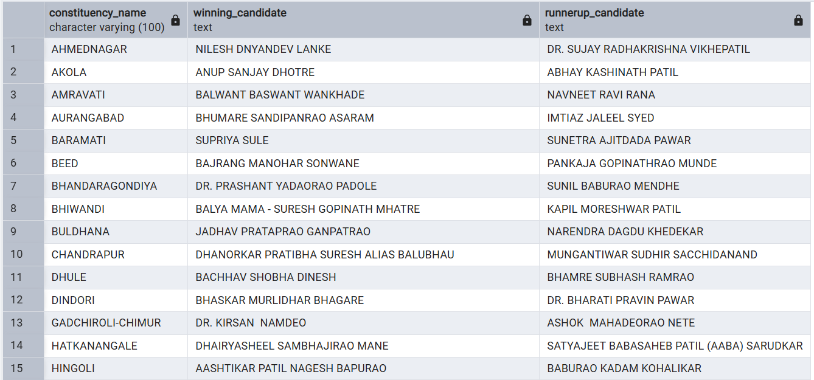

# 🗳️ Election Data Analysis (SQL Project)

This project presents a **comprehensive Election Data Analysis** using **SQL**, designed to uncover deep insights into **party performance, voter trends, and constituency-level outcomes** across India.  
It showcases the **end-to-end workflow** of a real-world data analyst — from **data modeling and database creation** to **complex analytical queries and visualization-ready outputs**.


---

## 🎯 Project Objective

To analyze large-scale election data and extract **meaningful insights** such as:
- Seats won by different political parties and alliances  
- State-wise and constituency-wise vote distributions  
- EVM vs Postal vote comparisons  
- Winning margins and top-performing candidates  
- Alliance-wise performance summaries across India  

---

## 🧩 Project Structure

```
├── Create_table_query.sql    # All CREATE TABLE Query
├── Problems.txt              # List of analysis questions
├── Solutions.sql             # All SQL analysis queries
├── Election_data.zip         # Contains 5 CSV datasets
├──📂images/
│ ├── ER_Diagram.png          # Schema diagram
│ └── Output.png              # Query Output example
└── README.md                 # Project documentation

```
---

## 🏗️ Database Design

- Designed **relational schema** with **5 key tables**:
  1. `constituencywise_details`
  2. `constituencywise_results`
  3. `statewise_results`
  4. `statewise_results_analysis`
  5. `partywise_results`

- Established **foreign key relationships** between constituency, state, and party tables.
- Added computed and derived columns such as `party_alliance` for advanced analytics.

📊 **ER Diagram:**


---

## 🧠 Key SQL Concepts Used

- **Data Definition (DDL):** Table creation, constraints, and relationships  
- **Data Manipulation (DML):** Inserting, updating, and transforming raw data  
- **Aggregations:** `SUM()`, `COUNT()`, `AVG()`, `GROUP BY`, `HAVING`  
- **Conditional Logic:** `CASE WHEN` for alliance classification  
- **Joins:** Inner, Left, and multi-table joins for relational insights  
- **Subqueries & CTEs:** Extracting top candidates and runner-ups  
- **Window Functions:** Ranking and comparison of candidates  
- **Data Enrichment:** Adding new analytical columns for deeper insights  

---

## 📈 Analytical Insights

Some of the key analyses performed include:

| # | Analysis | Description |
|---|-----------|--------------|
| 1 | Total Seats | Find total number of parliamentary seats |
| 2 | State-wise Seats | Seats available per state |
| 3 | NDA Alliance Performance | Seats won by NDA alliance parties |
| 4 | I.N.D.I.A Alliance Performance | Seats won by I.N.D.I.A alliance parties |
| 5 | Party-wise Seat Count | Seats won per party in each state |
| 6 | Alliance-wise Distribution | Seats won by alliances across all states |
| 7 | EVM vs Postal Votes | Compare total votes from both sources |
| 8 | Top 10 Candidates | Highest EVM votes across constituencies |
| 9 | Winner & Runner-Up | Find top 2 candidates in every constituency |
| 10 | Maharashtra Analysis | State-level party and alliance performance summary |

---

## 📝 Query Showcase (Example)

**Problem:** Which candidate won and which candidate was the runner-up in each constituency of State for the 2024 elections

#### Query
```sql
WITH RankedCandidates AS (
    SELECT cd.constituency_id,cd.candidate,cd.party,
        cd.evm_votes,cd.postal_votes,cd.total_votes,
        ROW_NUMBER() OVER (PARTITION BY cd.constituency_id 
			ORDER BY cd.total_votes DESC) AS VoteRank
    FROM constituency_details cd
    JOIN constituency_results cr ON cr.constituency_id = cd.constituency_id
    JOIN statewise_results sr ON 
		sr.parliament_constituency = cr.parliament_constituency
    JOIN states s ON s.state_id = sr.state_id
    WHERE s.state = 'Maharashtra'
)
SELECT cr.constituency_name,
    MAX(CASE WHEN rc.VoteRank = 1 THEN rc.candidate END) AS Winning_Candidate,
    MAX(CASE WHEN rc.VoteRank = 2 THEN rc.candidate END) AS Runnerup_Candidate
FROM RankedCandidates rc
JOIN constituency_results cr ON cr.constituency_id = rc.constituency_id
GROUP BY cr.constituency_name
ORDER BY cr.constituency_name;
```

#### Output :


---

## 💡 Tools & Technologies

| Category | Tools |
|-----------|-------|
| Database | PostgreSQL / MySQL |
| Language | SQL |
| Visualization | Power BI (optional for future) |
| Data Format | CSV |
| Skills Highlighted | Data Cleaning, Joins, Aggregation, Analytical Thinking |

---

## 🚀 Key Highlights

- Designed a **relational data model** for real-world election data  
- Applied **advanced SQL analytics** (CTEs, window functions, subqueries)  
- Created **alliance-based classification** logic (NDA, I.N.D.I.A, Others)  
- Generated **insightful summaries** for national and state levels  
- Delivered **clean, presentation-ready output** for reporting tools  

---

## 📚 Learning Outcomes

- Strengthened SQL skills in **data modeling, transformation, and analysis**  
- Improved understanding of **real-world relational data handling**  
- Developed reusable **query patterns** for future analytics projects  

---

## 🧾 How to Use

1. Import all `.csv` files from `/Election_data/` into your SQL database.  
2. Run the scripts from `Create_table_query.sql` to create tables.  
3. Execute queries from `Solutions.sql` to reproduce all analytical results.  
4. Refer to `Problems.txt` for understanding each analysis objective.  

---

## 🗳️ About the Project

An **end-to-end SQL data analysis project** on Indian Election data — from database design and schema creation to complex query-based insights.  
This project demonstrates my ability to work with **relational databases, data cleaning, aggregation, and analytical query optimization**, making it a strong showcase for real-world data analytics skills.

---

## 🧠 Author

**👤 Harsh Belekar**  
📍 Data Analyst | Python | SQL | Power BI | Excel | Data Visualization  
🔗 [LinkedIn](https://www.linkedin.com/in/harshbelekar) | [GitHub](https://github.com/Harsh-Belekar)

📧 **harshbelekar74@gmail.com**

---

## 🏷️ GitHub Repository Topics
`sql` • `data-analysis` • `postgresql` • `election-data` • `data-cleaning` • `joins` • `ctes` • `window-functions` • `end-to-end-project` • `data-analytics`
